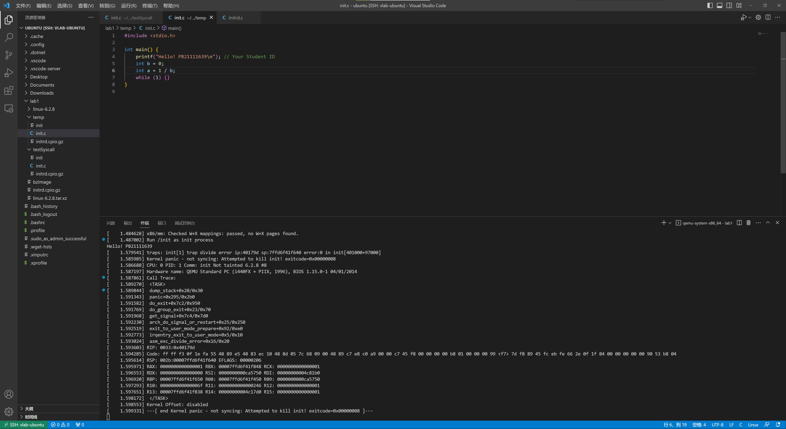

# Lab 1
## 实验过程：
### 一：裁剪Linux内核
    在config中去掉了ACPI，多余的驱动等不必要的选项，最终使编译得到的Linux内核约为3.4MiB。

### 二：创建初始内存盘：
    照助教提供的步骤成功输出了学号。
    另外，将init.c修改为下列代码可以导致kernel panic（提交的initrd.cpio.gz为按照原始代码编译得到的，未进行修改）：
```C
    #include <stdio.h>

    int main() {
        printf("Hello! PB21111639\n"); // Your Student ID
        int b = 0;
        int a = 1 / b;
        while (1) {}
    }
```

    原因是引发了除0异常。

### 三：添加自定义系统调用
    前面编写syscall程序和注册syscall的过程直接参照实验文档即可。
    测试系统调用的程序中使用了Linux文档中给出的syscall函数，利用我们编写的系统调用的编号548调用该函数。传入的buf和buf_len为自行定义的字符数组和该数组的长度。