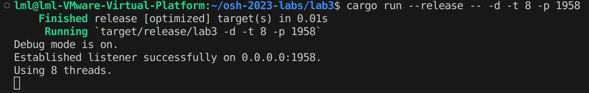
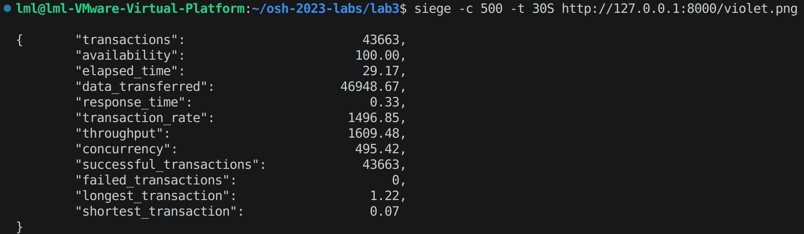
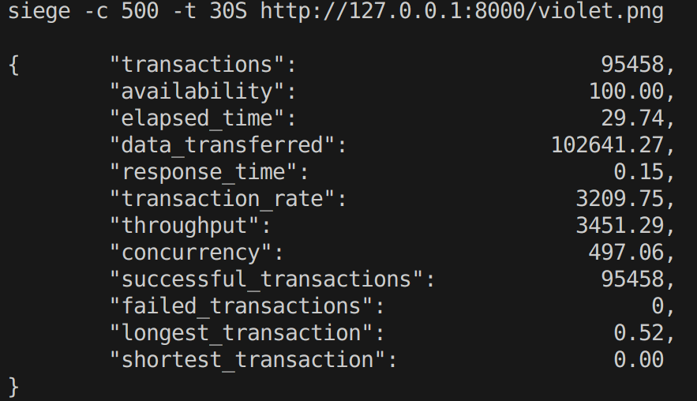

# 实验报告

## 编译方法与运行说明：
由于选做了异步I/O，因此在osh-2023-labs下有lab3和lab3_async两个文件夹。其中lab3是多线程（线程池）webserver，lab3_async是采用异步I/O的实现。lab3目录下的README_src是README文件的图片资源目录，请忽略该文件夹。

另外，当文件不存在时，webserver除返回状态行：`HTTP/1.0 404 NOT FOUND`外，还将额外返回一个Content，内容为`404 NOT FOUND`，以便浏览器查看。需要返回`500 Internal Server Error`时同理。

程序运行的根目录是lab3(或lab3_async)，网页资源文件请放在该目录下。

**两个webserver均需要使用Ctrl C结束运行。结束后bash中显示异常退出是正常现象。**

### 多线程webserver：
在lab3文件夹下，输入`cargo build`或`cargo build --release`即可编译，或者通过`cargo run`或`cargo run --release`一步构建并运行。

在启动时可以传递参数，用以修改线程数，端口等设置。支持的参数如下：

|参数|功能|
|-|-|
|-d|使程序在控制台输出debug信息|
|-t [num]|使用num个线程，默认为4，上限为20|
|-p [port]|使用port作为端口，程序将监听0.0.0.0:port。默认为8000|

运行示例：

### 异步I/O webserver：
不支持-t参数，其余操作与多线程webserver一样（请在lab3_async目录下执行`cargo run`等命令）。

## 选做内容：
1. 线程池
2. 异步I/O

## 整体设计和所用技术：

### 处理请求：
#### 解析请求：
一次Http请求的内容有很多，但实际只需处理请求行即可。

请求行即为一次请求的第一行。其中请求行又可分为请求方法，请求URL和请求版本3个部分，用空格分隔。

2个版本的程序（多线程和异步）均采用了寻找第一个和最后一个空格的位置，然后取字符串切片的方式来提取请求方法和URL。**对于两个空格的位置重叠或无空格的情况，将返回500（请求头不完整）。**

提取出方法和URL后，**对请求方法不是'GET'的请求直接返回500。**对URL，通过trim()和trim_match()去除两端多余的空格和'/'，然后即可当作本地文件的路径。

**对于空路径，webserver将返回500而非404。**

#### 返回资源：
截取路径中文件的扩展名，对文本文件（html，txt，css，htm，js）通过fs::read_to_string()方法读取字符串，其余文件则通过fs::read()读取字节流。然后通过Content-Length返回头返回。**如果读取错误，对于NotFound错误，返回404，其余错误返回500。**

### 多线程webserver：
采用线程池的方式实现。线程池的实现参考了Rust官方教程（ https://doc.rust-lang.org/book/ ，或Rust中文社区翻译版 https://kaisery.github.io/trpl-zh-cn/title-page.html ），即生成若干线程，main函数收到请求时通过`mpsc::channel`的sender向线程发送处理请求的闭包，线程不断尝试接收闭包并执行。由于mpsc是多生产者单消费者的，因此需要对receiver加锁，线程在接收前需先获取锁。

### 异步I/O webserver：
在单线程webserver的基础上修改。调用async-std包，在函数定义前加async，调用时加.await即可。另外在多线程版本中，main接收请求使用的是TcpStream实例的`incoming()`方法，该方法是阻塞的；在异步I/O版本中使用异步版本的TcpStream，需改成`incoming().for_each_concurrent()`方法，这里的`incoming()`是非阻塞的，且`for_each_concurrent()`可以同时处理从Stream获取的元素（注意，根据该方法的说明，它并没有采用多线程技术）。

## 使用siege测试：

### 测试环境：
在VMWare虚拟机下进行测试。

#### 物理机配置：
|||
|-|-|
|CPU|Intel i7 11800H|
|内存|16GB DDR4 3200Mhz|
|操作系统|Windows 10 家庭中文版 21H2|

#### 虚拟机配置：
|||
|-|-|
|VMWare版本|16.2.4 build-20089737|
|处理器|8处理器，每个处理器1内核|
|内存|4GB|
|操作系统|Ubuntu 23.04|

#### siege设置和测试文件：
并发数500，测试时间30S。测试文件采用位于程序根目录的violet.png（即下图），大小为1.08MB。

### 多线程webserver：
采用4线程进行测试，结果如下：

共处理了43663个会话，且全部成功。性能还不错。

### 异步I/O webserver：
结果如下：

共处理了95458个会话，且全部成功。

可以发现，在该测试条件下，异步I/O相比多线程，性能要高出1倍以上。